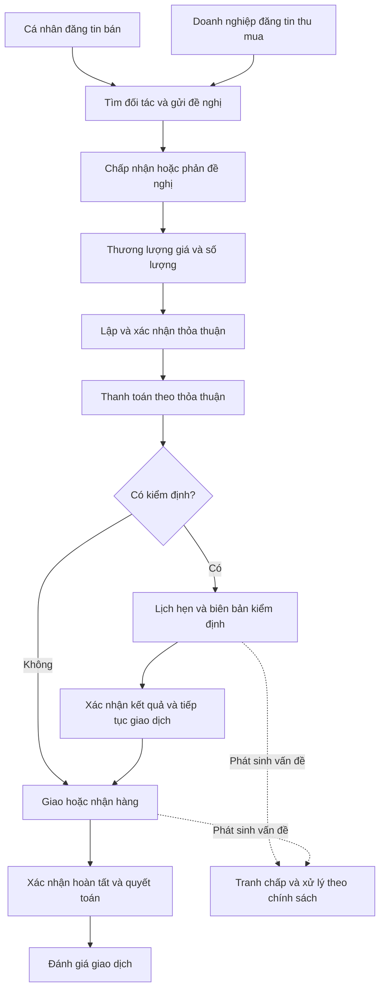

# HomeCycle-platform

**Backend API cho nền tảng kết nối cá nhân bán đồ đã qua sử dụng với doanh nghiệp thu mua.**

HomeCycle hỗ trợ quá trình giao dịch từ đăng tin, tìm đối tác, đề nghị giá và thương lượng đến lập thỏa thuận, kiểm định, thanh toán, giao nhận và xử lý tranh chấp. Mục tiêu của hệ thống là giúp sản phẩm tiếp tục được sử dụng thông qua một quy trình thu mua có thông tin, lịch sử và trách nhiệm rõ ràng giữa các bên.

Repository này chứa backend viết bằng **C# / ASP.NET Core 8**, sử dụng **PostgreSQL**, cung cấp REST API và cập nhật thời gian thực qua **SignalR**. Giao diện web/mobile không nằm trong repository này.

## Mục lục

- [Phạm vi nghiệp vụ](#phạm-vi-nghiệp-vụ)
- [Vai trò người dùng](#vai-trò-người-dùng)
- [Tính năng hiện tại](#tính-năng-hiện-tại)
- [Luồng giao dịch](#luồng-giao-dịch)
- [Kiến trúc và công nghệ](#kiến-trúc-và-công-nghệ)
- [Cấu trúc source code](#cấu-trúc-source-code)
- [Chạy dự án tại máy local](#chạy-dự-án-tại-máy-local)
- [Tài liệu API](#tài-liệu-api)
- [Phạm vi triển khai và lưu ý](#phạm-vi-triển-khai-và-lưu-ý)

## Phạm vi nghiệp vụ

Hệ thống hiện tập trung vào giao dịch giữa hai nhóm:

- **Cá nhân (Personal):** có sản phẩm đã qua sử dụng cần bán, đăng tin bán và làm việc với bên thu mua.
- **Doanh nghiệp (Business):** đăng nhu cầu thu mua, tìm nguồn hàng, gửi đề nghị và thực hiện giao dịch với cá nhân.

Sản phẩm được mô tả theo danh mục, loại sản phẩm, thương hiệu và thuộc tính riêng của từng loại; có thông tin tình trạng hoạt động, mức độ hư hại và hình ảnh để hỗ trợ đánh giá trước khi giao dịch.

Các khái niệm chính trong hệ thống:

| Khái niệm | Ý nghĩa nghiệp vụ |
| --- | --- |
| Sell Post / Buy Post | Tin bán của cá nhân / tin thu mua của doanh nghiệp |
| Offer | Đề nghị giá và số lượng ban đầu giữa hai bên |
| Negotiation | Phiên thương lượng, lưu tin nhắn và các đề xuất giao dịch |
| Agreement | Thỏa thuận về điều kiện giao dịch, kiểm định và giao nhận |
| Order | Đơn hàng dùng để theo dõi việc thực hiện giao dịch |
| Appointment / Inspection Form | Lịch kiểm định, lịch nhận hàng và biên bản kiểm định |
| Payment / Wallet | Thanh toán, số dư ví và lịch sử biến động tiền |
| Dispute / Review | Tranh chấp, báo cáo vi phạm và đánh giá sau giao dịch |

## Vai trò người dùng

| Vai trò | Chức năng chính |
| --- | --- |
| **Personal** | Đăng và quản lý tin bán; tìm tin thu mua; chào bán; thương lượng; xác nhận thỏa thuận, kiểm định và giao nhận; quản lý ví; đánh giá và khiếu nại |
| **Business** | Đăng và quản lý tin thu mua; khai báo hồ sơ, khu vực phục vụ và thông tin khảo sát; tìm nguồn hàng; thương lượng, kiểm định và thu mua; sử dụng gói dịch vụ và dashboard doanh nghiệp |
| **Moderator** | Xử lý hồ sơ cần kiểm duyệt, báo cáo và tranh chấp; tra cứu đơn hàng, lịch hẹn và thông tin tài chính phục vụ xử lý nghiệp vụ |
| **Admin** | Quản lý tài khoản và Moderator; danh mục sản phẩm, gói dịch vụ, chính sách nền tảng; theo dõi dashboard, tài chính và nhật ký kiểm toán |

Quyền thao tác còn phụ thuộc vào chủ sở hữu dữ liệu, trạng thái tài khoản và trạng thái của từng giao dịch.

## Tính năng hiện tại

### Tài khoản và hồ sơ

- Đăng ký tài khoản cá nhân/doanh nghiệp, đăng nhập bằng mật khẩu và Google.
- Xác thực OTP qua email, quên/đặt lại mật khẩu, access token và refresh token.
- Quản lý hồ sơ, ảnh đại diện, thông tin định danh và tài khoản ngân hàng.
- Hồ sơ doanh nghiệp gồm giấy tờ đăng ký, khảo sát và khu vực phục vụ; có luồng gửi hồ sơ và kiểm duyệt.
- Tích hợp Gemini để trích xuất thông tin từ ảnh giấy tờ định danh trong các luồng đăng ký/cập nhật hồ sơ.
- Quản trị tài khoản, khóa/mở khóa và kích hoạt tài khoản Moderator.

### Sản phẩm và bài đăng

- Quản lý danh mục, thương hiệu, loại sản phẩm, thuộc tính và lựa chọn thuộc tính.
- Cung cấp schema nhập liệu và thuộc tính lọc theo loại sản phẩm.
- Tạo, cập nhật, tìm kiếm và xem tin bán/tin thu mua; hỗ trợ tin nổi bật và khám phá nguồn hàng cho doanh nghiệp.
- Đóng, mở lại bài đăng và xử lý bài đăng vi phạm; có tác vụ nền xử lý tin thu mua hết hạn.
- Lưu bài đăng vào giỏ để theo dõi và tiếp tục thao tác giao dịch.
- Upload media và lưu trữ qua Firebase/Google Cloud Storage.

### AI hỗ trợ giao dịch

- **Gợi ý giá:** hỗ trợ cá nhân tham khảo giá khi soạn tin bán, sử dụng dữ liệu so sánh và tích hợp Gemini; có kiểm tra hạn mức sử dụng.
- **Ghép nguồn hàng:** tìm tin bán phù hợp với nhu cầu thu mua của doanh nghiệp, hỗ trợ nhu cầu dạng bản nháp hoặc tin đã đăng; có tích hợp Gemini để sắp xếp lại kết quả.
- **Theo dõi kết quả ghép:** tác vụ nền kiểm tra nguồn hàng phù hợp và phát thông báo theo cấu hình.

Giá gợi ý và kết quả ghép là thông tin hỗ trợ; giá giao dịch cuối cùng được hai bên xác lập qua thương lượng và thỏa thuận. Khả năng AI phụ thuộc cấu hình, hạn mức và dịch vụ bên ngoài.

### Đề nghị, thương lượng và thỏa thuận

- Gửi, sửa, hủy, chấp nhận, từ chối hoặc phản đề nghị giá/số lượng.
- Quản lý hội thoại, tin nhắn, lịch sử đề xuất và trạng thái thương lượng.
- Lập thỏa thuận, xem trước, yêu cầu chỉnh sửa, chấp nhận hoặc hủy; xuất thỏa thuận PDF.
- Hỗ trợ giao dịch có kiểm định hoặc không kiểm định.
- Xem trước phí, dịch vụ và thời gian giao dự kiến qua GHN.

### Đơn hàng, kiểm định và giao nhận

- Theo dõi đơn hàng, timeline và trạng thái thực hiện giao dịch.
- Quản lý lịch kiểm định/nhận hàng, check-in, đề xuất đổi lịch, chấp nhận/từ chối đổi lịch và hủy lịch.
- Tạo, chỉnh sửa, gửi biên bản kiểm định; người bán xác nhận hoặc từ chối kết quả; hỗ trợ lên lịch nhận hàng sau kiểm định.
- Hỗ trợ **GHN giao hàng**, **người bán tự giao** và **người mua đến nhận**, tùy điều kiện của luồng giao dịch.
- Tạo vận đơn GHN qua tác vụ nền, tiếp nhận webhook và đồng bộ trạng thái vận chuyển.
- Hủy đơn theo điều kiện nghiệp vụ; xác nhận trả hàng/nhận lại hàng và xử lý hoàn tiền.

### Thanh toán, ví và gói dịch vụ

- Xem số tiền cần thanh toán, thanh toán thỏa thuận bằng ví hoặc checkout payOS.
- Tiếp nhận webhook payOS và có tác vụ đồng bộ lại các thanh toán đang chờ.
- Quản lý số dư ví, sổ cái, lịch sử giao dịch và yêu cầu rút tiền; có tích hợp payOS Payout.
- Theo dõi tiền giữ theo đơn hàng, giải ngân, hoàn tiền và các biến động tài chính liên quan.
- Quản lý gói dịch vụ, quyền lợi, gói miễn phí, đăng ký/hủy gói và thanh toán gói.

### Uy tín, kiểm duyệt và vận hành

- Đánh giá giao dịch, xem đánh giá nhận được và thông tin uy tín trên hồ sơ công khai.
- Báo cáo bài đăng/đánh giá và mở tranh chấp đơn hàng.
- Moderator tiếp nhận, giải quyết hoặc từ chối tranh chấp; hỗ trợ xác minh hoàn trả hàng.
- Quản lý chính sách nền tảng và danh mục lý do tranh chấp.
- Dashboard quản trị/doanh nghiệp, thông báo, nhật ký kiểm toán và tác vụ lưu trữ nhật ký theo thời hạn cấu hình.
- Cập nhật thời gian thực cho chat, thông báo, đơn hàng, lịch hẹn, giỏ và tài chính.

## Luồng giao dịch



Đây là luồng tổng quan. Điều kiện thanh toán, đổi lịch, hủy, hoàn trả và hoàn tất được kiểm tra theo từng nhánh nghiệp vụ và chính sách hiện hành trong hệ thống.

**Một số quy tắc cần hiểu khi đọc code:**

- Offer đang chờ chưa đồng nghĩa với đơn hàng đã được tạo. Chấp nhận giá/số lượng mở hoặc chốt phiên thương lượng; bước thỏa thuận và thanh toán được xử lý riêng.
- Chấp nhận Offer chỉ giữ chỗ, chưa trừ `RemainingQuantity` tại bước đó.
- Trạng thái bài đăng gồm `Draft`, `Active`, `Suspended`, `Closed`, `Deleted`; trạng thái đơn hàng gồm `Pending`, `Processing`, `Completed`, `Cancelled`, `Disputing`, `Returned`.
- Việc hủy đơn phụ thuộc mốc thực hiện: đơn có kiểm định trước check-in, đơn giao trực tiếp trước khi người bán xác nhận chuẩn bị hàng, hoặc đơn GHN trước khi GHN lấy hàng (`ready_to_pick`/`picking`). Khi hủy, người mua được hoàn tiền hàng và phí ship GHN. Sau mốc này, vấn đề được xử lý qua tranh chấp.
- Khi trả hàng, hệ thống ghi nhận xác nhận của bên mua và bên bán; Moderator có luồng xác minh khi bên bán không phản hồi đúng hạn.

## Kiến trúc và công nghệ

Backend được tổ chức theo các tầng, tách API, xử lý nghiệp vụ, mô hình miền và truy cập dữ liệu/tích hợp.

| Thành phần | Công nghệ / trách nhiệm |
| --- | --- |
| API | ASP.NET Core 8, REST controllers, Swagger/OpenAPI |
| Nghiệp vụ | Application services, DTOs, FluentValidation, interfaces |
| Dữ liệu | Entity Framework Core 8, Npgsql, PostgreSQL |
| Xác thực | JWT Bearer, refresh token, Google authentication |
| Thời gian thực | ASP.NET Core SignalR |
| AI | Google Gemini / Google GenAI |
| Thanh toán | payOS, payOS Payout |
| Vận chuyển | GHN API và webhook |
| Lưu trữ và email | Firebase/Google Cloud Storage, MailKit/SMTP |
| Đóng gói | Docker multi-stage build cho .NET 8 |

## Cấu trúc source code

```text
HomeCycle-platform.sln
├── HomeCycle.API/              # Controllers, SignalR hub, middleware, workers, cấu hình host
├── HomeCycle.Application/      # Services nghiệp vụ, DTOs, validation, interfaces, pricing/matching
├── HomeCycle.Domain/           # Mô hình miền và enums nghiệp vụ
├── HomeCycle.Infrastructure/   # DbContext, persistence entities, repositories, security, integrations
├── HomeCycle.Share/            # Thành phần dùng chung
└── README.md
```

Để tìm hiểu một chức năng, bắt đầu từ controller trong `HomeCycle.API/Controllers`, theo interface/service tương ứng trong `HomeCycle.Application`, rồi xem repository và tích hợp trong `HomeCycle.Infrastructure`.

## Chạy dự án tại máy local

### 1. Chuẩn bị môi trường

- .NET SDK 8.
- PostgreSQL và database có schema/dữ liệu nền phù hợp với `HomeCycleDbContext`.
- Thông tin kết nối các dịch vụ bên ngoài cho chức năng cần sử dụng.
- Docker nếu muốn chạy API bằng container.

**Database:** repository hiện chưa có bộ EF migrations hoặc script SQL khởi tạo database. Cần chuẩn bị database tương thích từ môi trường phát triển của dự án trước khi sử dụng các API truy cập dữ liệu. Chạy API không tự tạo đầy đủ schema hay dữ liệu danh mục, chính sách và tài khoản.

### 2. Cấu hình

Host đọc cấu hình từ `HomeCycle.API/appsettings.json`, file theo môi trường, User Secrets trong Development và biến môi trường. Dùng giá trị của môi trường riêng; không đưa mật khẩu, API key hoặc private key vào README hay commit mới.

| Nhóm cấu hình | Nội dung |
| --- | --- |
| `ConnectionStrings:DefaultConnection` | Kết nối PostgreSQL |
| `Jwt` | `SecretKey`, `Issuer`, `Audience`, thời hạn token |
| `EmailSettings` | SMTP server, port, email và thông tin xác thực |
| `GoogleAuth:web` | Thông tin ứng dụng Google, gồm `client_id` |
| `Firebase` | Bucket và các trường service account trong `CredentialPath` |
| `GHNSettings` | Base URL, token, shop ID, webhook secret và cấu hình worker |
| `PayOS` / `PayOSPayout` | Thông tin checkout, webhook, payout và đồng bộ thanh toán |
| `Gemini` | API key, model, timeout, cache và các tùy chọn AI |
| `SupplierMatching` / `SupplierMatchMonitor` | Hạn mức kết quả, cache và theo dõi nguồn hàng |
| `FreePlan` | Quyền lợi mặc định của tài khoản cá nhân/doanh nghiệp |
| `ModeratorActivation` | URL frontend và thời hạn token kích hoạt Moderator |
| `OrderLifecycleWorker` / `AuditLog` | Chu kỳ xử lý đơn hàng và cấu hình nhật ký kiểm toán |

Ví dụ đặt kết nối database bằng User Secrets, chạy từ thư mục gốc repository:

```powershell
dotnet user-secrets set "ConnectionStrings:DefaultConnection" "Host=localhost;Port=5432;Database=homecycle;Username=<db-user>;Password=<db-password>" --project HomeCycle.API
dotnet user-secrets set "Jwt:SecretKey" "<your-long-random-signing-key>" --project HomeCycle.API
```

Với biến môi trường, dùng `__` thay cho `:`, ví dụ `ConnectionStrings__DefaultConnection` hoặc `Gemini__ApiKey`. Các ví dụ trên chỉ minh họa cách ghi cấu hình; cần hoàn thiện các nhóm cấu hình mà host và chức năng sử dụng yêu cầu.

### 3. Restore, build và chạy

```powershell
dotnet restore HomeCycle-platform.sln
dotnet build HomeCycle-platform.sln
dotnet dev-certs https --trust
dotnet run --project HomeCycle.API --launch-profile https
```

Swagger theo profile HTTPS hiện tại: **https://localhost:7052/swagger**.

### 4. Chạy bằng Docker

Build từ thư mục gốc để Dockerfile truy cập đủ các project:

```powershell
docker build -f HomeCycle.API/Dockerfile -t homecycle-api .
docker run --rm -p 8080:8080 --env-file .env.local -e ASPNETCORE_ENVIRONMENT=Production -e ASPNETCORE_HTTP_PORTS=8080 homecycle-api
```

Chuẩn bị `.env.local` với các khóa cấu hình dùng dấu `__` và giữ file này ngoài Git. PostgreSQL và các dịch vụ bên ngoài phải truy cập được từ container; `localhost` trong container là chính container đó. Repository hiện có Dockerfile cho API, chưa có Docker Compose để dựng toàn bộ hệ thống.

## Tài liệu API

- **Swagger UI:** `/swagger`.
- **OpenAPI JSON:** `/swagger/v1/swagger.json`.
- **SignalR hub:** `/hubs/chat`, yêu cầu xác thực.

| Nhóm API | Route chính |
| --- | --- |
| Tài khoản | `/api/auth`, `/api/business-profiles` |
| Danh mục sản phẩm | `/api/categories`, `/api/brands`, `/api/product-types` |
| Bài đăng và giỏ | `/api/posts`, `/api/cart` |
| Gợi ý AI | `/api/ai/price-suggestions`, `/api/ai/supplier-matches` |
| Trao đổi | `/api/offers`, `/api/negotiations`, `/api/conversations`, `/api/messages` |
| Thỏa thuận và lịch hẹn | `/api/agreements`, `/api/appointments`, `/api/inspection-forms` |
| Giao nhận | `/api/shipments` |
| Thanh toán và ví | `/api/payments`, `/api/wallet` |
| Gói dịch vụ | `/api/subscription-packages` |
| Đánh giá và thông báo | `/api/reviews`, `/api/notifications` |
| Quản trị | `/api/admin/audit-logs`, `/api/business/dashboard` và các API quản trị theo module |

Xem Swagger/controller để biết method, request, response và quyền truy cập cụ thể. Với API có xác thực, nhập access token vào **Authorize** trên Swagger; client HTTP gửi header `Authorization: Bearer <access-token>`.

## Phạm vi triển khai và lưu ý

- Danh sách tính năng mô tả các module/luồng có trong source hiện tại; không phải xác nhận mọi luồng đã được kiểm thử end-to-end hoặc đang vận hành production.
- Các chức năng thanh toán, vận chuyển, upload, email và AI cần tài khoản dịch vụ cùng cấu hình hợp lệ. Webhook cần URL backend mà dịch vụ bên ngoài truy cập được.
- Quét giấy tờ bằng AI hỗ trợ nhập thông tin, không được hiểu là chứng nhận định danh độc lập.
- Repository hiện chưa có project kiểm thử tự động hoặc file license. Kiểm tra `dotnet build` và xác minh các luồng tích hợp trên môi trường phù hợp trước khi triển khai; thống nhất giấy phép sử dụng với chủ sở hữu dự án khi cần phân phối lại.
- Khi thay đổi nghiệp vụ, cập nhật đồng thời controller/service, validation, chính sách liên quan và phần mô tả tương ứng trong README.
